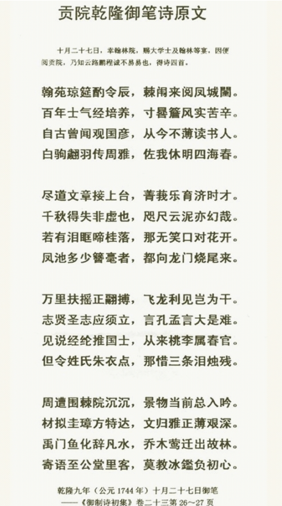

"莫教冰鉴负初心" — "let not the ice mirror betray the original aspiration" — comes from a poem by the Qianlong Emperor. It is also an exhortation that Hangzhou High School (杭州高级中学) gives its students, and it carries memories of our time there. People around me often quote the couplet "而今更笃凌云志，莫教冰鉴负初心" — "now hold even more firmly to your soaring ambitions, and let not the ice mirror betray the original aspiration" — as encouragement to keep working hard and never forget why we started.

But after reading the original poem, I found that its actual meaning points somewhere else.

Image source: the official website of Hangzhou High School.

The Zhigong Hall (至公堂) was where the examiners worked inside the imperial examination hall. The "ice mirror" (冰鉴) is a metaphor for clear, impartial judgment. The poem was urging the examiners to be scrupulously discerning, so that their judgment would not betray the aspirations of scholars who had studied through long, cold years.

In the original poem, the one holding the ice mirror was the examiner. Today, the one holding it is ourselves.

As AI develops rapidly, I've noticed that some people around me are growing more restless: some compare titles with one another, while others are left lost by all kinds of radical claims about AI. It suddenly struck me that what makes us betray our original aspiration may not be hardship that makes us retreat, nor comfort that makes us slack off, nor even the examiner's eye, but perhaps the restlessness of this era, which quietly clouds our judgment and makes it hard to persevere.

The basis for our judgments and actions should not be what the people around us have, nor conclusions others have drawn online. It should be drawing valuable information from our surroundings, thinking independently, judging for ourselves, and then pursuing our dreams with determination.

This is how I understand "let not the ice mirror betray the original aspiration" today.

*This post was translated from the Chinese original by Claude.*
