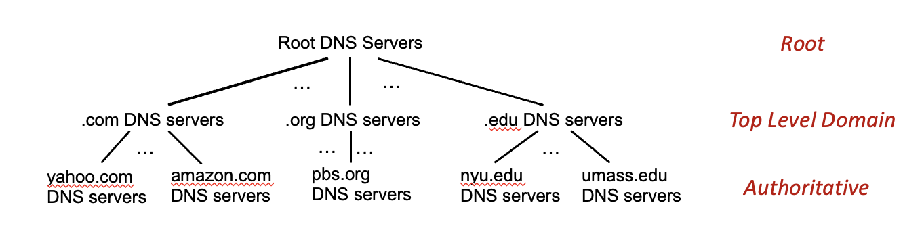

Reference: https://gaia.cs.umass.edu/kurose_ross/videos/2/

### HTTP

- Hypertext Transfer Protocol

- HTTP/1.1 and HTTP/2 use TCP

  - The client opens a connection and the server accepts it
  - Messages are exchanged
  - The connection is closed

- It is stateless: it keeps no record of past requests

- Types

  - Non-persistent: every object requested needs a new TCP connection

  

  - Persistent: multiple objects can be requested over the same TCP connection

HOL blocking stands for Head-of-Line Blocking. It means that while the data at the front of the queue has not been fully processed, the data behind it has to wait as well, even if it is already ready. Both HTTP/2 and HTTP/3 address HOL blocking.



HTTP/1.1, HTTP/2 (assuming TLS): HTTP → TLS → TCP → IP
HTTP/3: HTTP/3 → QUIC → UDP → IP

Improvements of HTTP/3 over HTTP/2

**HTTP/2 runs over a single TCP connection.** TCP only knows about one ordered byte stream; it has no idea that there are multiple HTTP streams above it. If a TCP segment is lost, the kernel holds all data received after it in the buffer, and only hands it to the application in order once the lost segment has been retransmitted. As a result, even if what was lost is just one frame of stream A, the data of streams B and C gets stuck too, even though it has already arrived.

**HTTP/3 runs over QUIC, and QUIC runs over UDP.** QUIC knows at the transport layer that there are multiple independent streams, and performs in-order delivery and loss retransmission separately for each stream. If stream A loses a packet, only stream A has to wait for the retransmission; the data of streams B and C can be delivered to the application right away.

### DNS

**Recursive query**

The asker says: "Please give me the final answer." The server being asked must take on the whole lookup itself, querying other servers on its own, and returns only the final result (an IP address, or an error saying the domain does not exist).

**Iterated query**

The asker says: "Tell me as much as you know." The server being asked answers only from the information it has: if it knows the answer, it gives it directly; if not, it returns a referral, i.e. "go ask such-and-such server, its address is ...". The asker then queries the next server itself.

**Both appear in a typical DNS resolution**

| Parties to the query                          | Type      | Reason                                                                                   |
| --------------------------------------------- | --------- | ---------------------------------------------------------------------------------------- |
| Host → local DNS                              | Recursive | The host only wants the result and doesn't want to make several round trips itself      |
| Local DNS → root / TLD / authoritative server | Iterated  | Upper-level servers only give referrals; the local DNS server walks down level by level |

DNS record types

- A: the domain's IPv4 address
- AAAA: the domain's IPv6 address
- NS: the domain's authoritative name server (when a domain is registered, the servers of the parent domain, e.g. the `.com` TLD, store its NS record; the value of an NS record is a domain name, not an IP. When that name lies inside the domain itself, the TLD server must also store its A record to avoid a circular dependency)
- CNAME: maps an alias to its canonical domain name
- Others omitted

### Socket programming

The term datagram can mean one of two things

- It can be an IP datagram at the network layer
  - Structure: IP header + payload (when not fragmented, the payload holds one TCP segment or UDP datagram).
  - Produced by: the kernel's network layer, by prepending an IP header to the transport-layer unit.
  - In this course, the network layer is described in terms of datagrams rather than IP packets
- It can also be a UDP datagram at the transport layer
  - Structure: UDP header + the application's message.
  - The UDP header contains no IP addresses, only the source and destination ports
  - Produced by: the application supplies the message and destination address through `sendto()`, and the kernel adds the UDP header at the transport layer

**Encapsulation order when sending**

| Step | Layer       | What happens                                                                              | Resulting unit |
| ---- | ----------- | ----------------------------------------------------------------------------------------- | -------------- |
| 1    | Application | The application calls `send()` or `sendto()` and writes data into the socket              | **message**    |
| 2    | Transport   | The kernel adds a TCP or UDP header to the message (port numbers, checksum, etc.)         | **segment**    |
| 3    | Network     | The kernel adds an IP header to the segment (source IP, destination IP, etc.)             | **datagram**   |
| 4    | Link        | The NIC driver adds an Ethernet frame header and trailer to the datagram                  | **frame**      |

TCP

- Transport-layer protocol
- Reliable delivery, in-order delivery, flow control, congestion control; no security guarantees
- Used for file transfer (FTP) and e-mail (SMTP)
- Implemented by the OS kernel
- Security comes from TLS (Transport Layer Security): application → TLS → TCP → IP. TLS runs in user space, but it is usually provided by a library rather than implemented by the user.

UDP

- Transport-layer protocol
- No handshake
- No guarantee of reliable or in-order delivery
- Implemented by the OS kernel

Sockets

- A socket is a communication endpoint that the operating system provides to an application process. The process hands data to the transport layer (TCP/UDP) through it, and gets data back from the transport layer through it. In terms of network layering, a socket is the interface between the application layer and the transport layer: everything above it is controlled by the application developer, and everything below it is controlled by the OS kernel.
- **UDP socket**: identified by the pair (local IP address, local port number). All datagrams sent to this pair are delivered to the same socket, no matter which sender they come from. A socket is an OS abstraction that can be bound to a process; it doesn't necessarily correspond to any particular layer. The source port is written into the UDP header at the transport layer, and the source IP into the IP header at the network layer.
- **TCP socket**: an established connection is identified by a 4-tuple (source IP, source port, destination IP, destination port). So a server can have many connection sockets on the same port (e.g. 80) at the same time, each for a different client.
  - The server creates only one listening TCP socket; every time a client's connection request is accepted, the server creates a new TCP socket
- TCP and UDP are implemented by the OS kernel; applications use them through system calls (`socket()`, `send()`, etc.)

---

*This post was translated from the Chinese original by Claude.*
