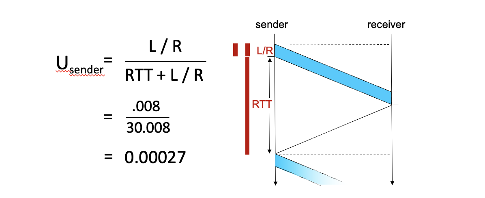
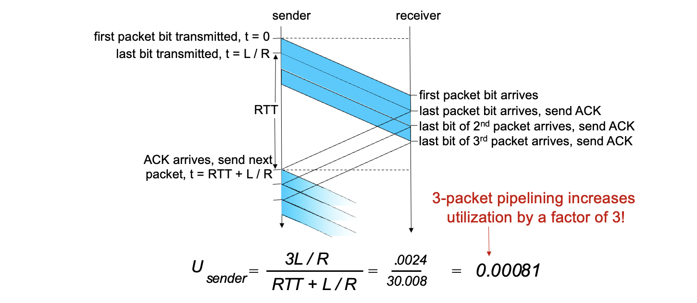
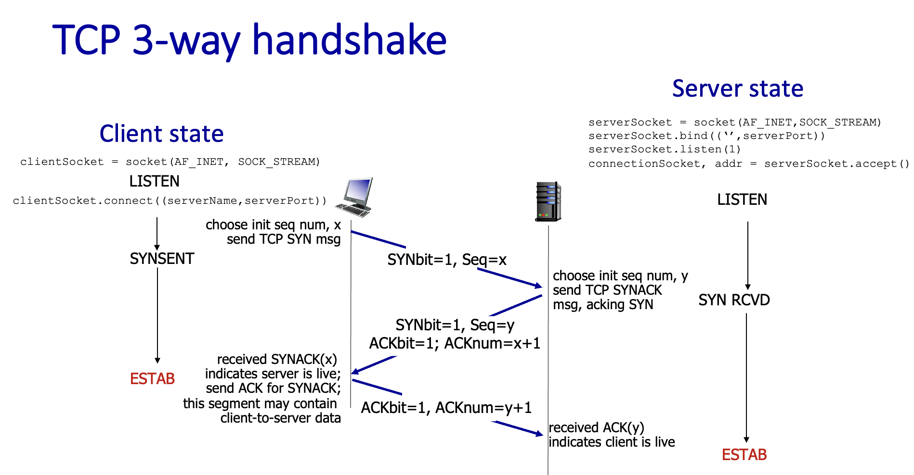
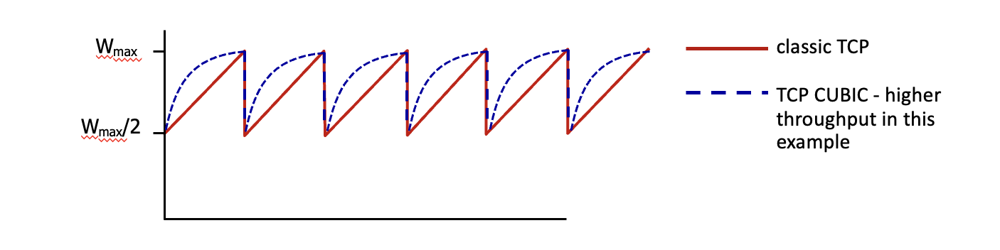
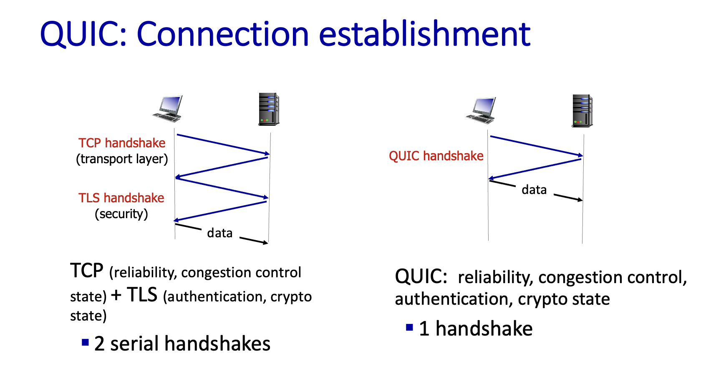

参考资料： https://gaia.cs.umass.edu/kurose_ross/videos/3/

### 基本概念

- 网络层为主机之间提供逻辑通信。
- 传输层为运行在不同主机上的进程之间提供逻辑通信。传输层本身不负责把数据从一台主机搬到另一台主机，实际的跨主机搬运由网络层及以下各层完成。传输层只在两端主机上运行，它做的是把网络层"主机到主机"的交付延伸成"进程到进程"的交付，所以这里表达成逻辑通信。

### multiplexing与demultiplexing

- socket可以认为是与进程相连的通信接口，不与特定的层绑定。除了TCP的监听端口只能收，一个socket是既能收，也能发的。
- Multiplexing：发送端传输层从多个 socket 收集数据，为每份数据加上含端口号的传输层首部，封装成报文段，交给同一个网络层发送。
- Demultiplexing：接收端传输层根据报文段首部的端口号（以及 IP 首部中的地址），把同一个网络层交上来的报文段分发到正确的 socket。
- socket按照如下标识区分是否相同
  - **UDP socket**：（本地 IP，本地端口）
  - **TCP 监听 socket**：（本地 IP，本地端口）
  - **TCP 连接 socket**：（本地 IP，本地端口，对端 IP，对端端口）

### UDP

- User Datagram protocol
- UDP segment如下



- UDP仅仅实现了基本功能，例如multiplexing , demultiplexing还有校验。
- 它是面向消息的，是不保证顺序的，后续怎么处理是应用层的事情。

### RDT

- reliable data transfer protocol,上课自定义的一个协议。目前实现的是一个简化版本，也就是说，它只能实现单向的信息传输。接收方可以会消息给发送方，但是这个消息不是我们需要传递的信息。
- 第一版
  - 发送方发送，接收方回包(ACK/ NACK，ACK表示acknowledgement，表示收到包并经过校验完整)，如果发送方没有看到ACK回包，就重新传输
  - 第一版的问题在于，ACK包坏了，发送方还会重新传递消息，结果被接收方认为是发送方传递的第二个独立消息，导致错误。
- 第二版
  - 发送方发送消息的时候加上1 bit的序列号
  - 当接收方等待序列号为1的消息的时候，如果收到完整的序列号为1的消息，那么切换到等待序列号为0的消息的状态，并且返回ACK;如果收到序列号为0的消息，那么就返回ACK并且状态不改变。
  - 第二版问题在于： 首先，如果ACK丢失而不是坏了，那么发送方可能一直在等接收方结果而不是重传；同时，ACK答复传输过慢可能会被当做是另一个包的ACK
- 第三版
  - 在第二版的基础上加上，发送方超时没有收到ACK就重传，并且ACK加上序列号的那个1 bit

性能分析

- 对于一个链路，可以近似看成推进去的bit数与时间呈正比关系
- **RTT（Round-Trip Time，往返时间）** 是一个小分组从发送方出发、到达接收方、再由接收方发回响应、回到发送方所经过的总时间。

解决方式: pipeline

- 要知道这是第几个包，肯定要对包进行编号。但是编号是周期循环的，不是无限的，因此发送方与接收方都要有一个window，在这个序列号范围内的是可以发送的或者接收的。

下面是两种pipline的具体实现方式，假设窗口长度为N。

一个是go-back N:

- 发送方把window内的包都发出去，收到ACK之后，把窗口向前移动。然后如果窗口内最早的包超时还没有收到ACK，那么就把窗口内所有发过的包重新发送一遍。
- 接收方依次收包，返回包含目前已经按照顺序正确收到的最大序号的ACK
- 发送方窗口可能比接收方窗口晚N ，所以需要正确设计保证序号不会重复导致误解。这一点接收方遇到非顺序的包是缓存还是丢弃会导致最终的序号空间长度结论不同。

还有一个是selective repeat:

- 接收方对每一个包都单独ACK，发送方遇到单个包超时后会单独重传。
- 同样，因为发送方窗口可能比接收方窗口晚N，所以这2N个序号需要能够被表示成不同的序列号。

### TCP

- TCP基本特点
  - 点对点
  - 可靠有序
  - 一个连接可以进行双向传输
  - cumulative ACK
  - Connection-oriented
  - Flow controlled
- TCP segment



- TCP 把应用交给它的数据看成一条连续的字节流，而不是一个个独立的消息。TCP 中应用多次调用 `send()` 写入的数据，会被当成同一条字节流的后续部分。TCP 再按自己的需要把这条流切成若干 segment 发送，原来每次 `send()` 的边界不会保留下来。
- Sequence number 的定义：一个 TCP segment 的 sequence number，是该 segment 携带的数据中第一个字节在字节流里的编号。所有编号都是模 2³² 的结果。
- acknowledgement number : 接收方回ACK的时候表示接收方期待收到的下一个**字节**的编号。
- TCP双向传输的实现(全双工)： 一个 segment 可以在发送数据的同时携带对反方向数据的确认（piggybacking）
- 超时时间的设置
  - 需要估算一个包的往返时间RTT
  - EstimatedRTT= (1-a)EstimatedRTT+a (SampleRTT)
  - 然后实际超时的时间是EstimatedRTT加一个余量4DevRTT，这个余量估算方式如下。
  - DevRTT **=** (1-b)DevRTT + b|SampleRTT-EstimatedRTT|
- TCP fast retransmit
  - 发送方连续收到4次相同包的ACK(3个duplicate ACK)，则认为有一个包传输失败，导致接收方收到序列号更大的包后还是传输之前的包的ACK，因此，在超时之前就会重新传输那一个特定的包。
- TCP flow control
  - Receive window（rwnd）的定义：接收方的接收缓冲区当前还剩多少空闲字节，即它此刻还愿意接收多少字节。
  - 发送方把unACKed的数据限制在rwnd范围内。
- TCP: 连接导向
  - 二次握手
    - 客户端发消息说想建立连接，服务端回应接收连接，然后服务端留出一个socket资源。
    - 问题在于，如果某个客户端建立连接的消息延迟了，在结束连接之后才发到，那么服务端就会错误地留出连接资源，并且可能接受之前接受的其他连接消息错误地操作了。
  - 三次握手
    - 这里Seq是每次依据时间等生成的随机数。收到对面的确定连接之后核对过一遍是否是自己这次连接发送的随机数，如果是才是对面这次真的想连接。这里的 seq 也是 segment 头部里的 sequence number。

- TCP关闭连接
  - 发送TCP段时，把FIN bit设置为1，表示我这个方向不会再次向你这个方向发送消息了。它同样需要ACK。两个方向都告知过对方FIN之后，连接关闭。

### Congestion

- Congestion control不同于flow control
  - 前者是路由器面对多个不同来源的包时的拥挤
  - 后者是接收者接收不了发送者发送的那么多数据，处理速度跟不上。
- 造成阻塞的原因
  - 假设路由器的buffer无限长。假设路由器输入的最大带宽是R，输出最大带宽也是R，如果发包的机器就是以R这样的带宽发包，由于网络的不稳定性，这个速度有时候大于R，有时候小于R，可能导致路由器buffer的累积与延迟的增长。
  - 丢包之后可以重新传输, 这些重传的包占用链路带宽，但最终仅仅在带宽计算中算一个包，因此，会降低总带宽。
  - 有时候，从起点到终点可能要经过多个路由器，假设路由器A与路由器B，假设它的重传输把A的带宽占满了，可能会导致另一个把A路由器作为第二跳的线路无法传输。
- congestion control
  - 发送者观察到延迟或者丢包减慢发送速度
  - 路由器明确通知发送者拥堵了，从而减慢发送速度。

### TCP congestion control

| 窗口          | 谁决定                                                  | 防止什么                     |
| ------------- | ------------------------------------------------------- | ---------------------------- |
| 接收窗口 rwnd | 接收方，根据自己缓冲区还剩多少空间，通过 ACK 告诉发送方 | 把**接收方**撑爆（流量控制） |
| 拥塞窗口 cwnd | 发送方，根据有没有丢包自己估计                          | 把**网络**堵死（拥塞控制）   |

发送方实际能用的窗口是两者取小：

**实际窗口 = min(cwnd, rwnd)**

**发送速率 ≈ 窗口大小 / RTT**

那么这里不考虑rwnd，仅仅考虑cwnd

- AIMD(additive increase multiplicative decrease): 发送方每个 RTT 把拥塞窗口加上一个固定量，直到发生丢包；丢包或者超时后把窗口乘以一个系数（乘性减，如减半），或者直接置为1 MSS，取决于具体实现。 
  - 对于一般的链路，AIMD会有锯齿波动，但是在一般的链路里，路由器的缓冲区与多流叠加会掩盖这层开销

- slow start
  - 初始的时候cwnd是1MSS(max segment size)
  - 然后经过每一个RTT，这个cwnd翻倍
- slow start使得cwnd增长，cwnd到上一次丢包的cwnd的一半，增长方式就转化成线性上升
- TCP CUBIC
  - 使用三次函数的形式而非线性的形式让cwnd上升，更快接近最终临界丢包的点。CUBIC 距离上次丢包时的窗口较远时增长快，接近时放缓，越过后再加速试探。

- 基于延迟的congestion control
  - 与没有congestion相比，RTT过长就认为是congestion，然后减缓发包。
- Explicit congestion notification(ECN)
  - 路由器遇到congestion的时候在IP header中标记ECN
  - 接收端在返回ACK的时候在segment中标记ECE， 表示congestion
  - 最终发送端调整window size
- 公平性
  - 两个TCP连接经过同一条路，假设它们RTT相同、连接数固定，并且在拥塞避免阶段(cwnd线性增长，不是慢启动阶段)。可能一开始两个TCP连接的cwnd不同，但是由于AIMD在congestion之后会除以2，cwnd大的那一方下降得更多，但是之后没有congestion之后两者的增速是一样的，这样最终这两条链路就会达到近似相同的速度。
  - TCP的流量确实有可能被UDP挤占
  - 同时开多条TCP连接也确实可以有效提升传输的带宽

### QUIC

- 上图中TCP的第三次握手与TLS的第一次握手是同一个箭头。
- QUIC的那个handshake中已经负责了安全加密，不用像TLS一样再单独多用一次握手做加密。
- TCP 只认一条有序的字节流，不知道流里的数据属于哪个对象，只能严格按字节顺序交给应用。例如在同一条 TCP 连接上交错传输对象 A、B、C 的分段（如 HTTP/2）：`[A-1][B-1][C-1][A-2][B-2]`。若 `C-1` 丢失，之后已经到达的 `A-2`、`B-2` 也必须在接收缓冲区中等待，直到 `C-1` 重传成功，才能按序交给应用。一个对象丢包拖住了所有对象，这就是队头阻塞（HOL blocking）。
- QUIC还可以在一个连接中实现多个独立的流，它们可以并行传输数据，自行做可靠性传输，丢包了这个流自己负责，但是拥塞控制是共同的。它没有HOL blocking，因为某条流的数据只要在这条流内部是连续的，就可以交给应用，不需要管其他流有没有缺口。
